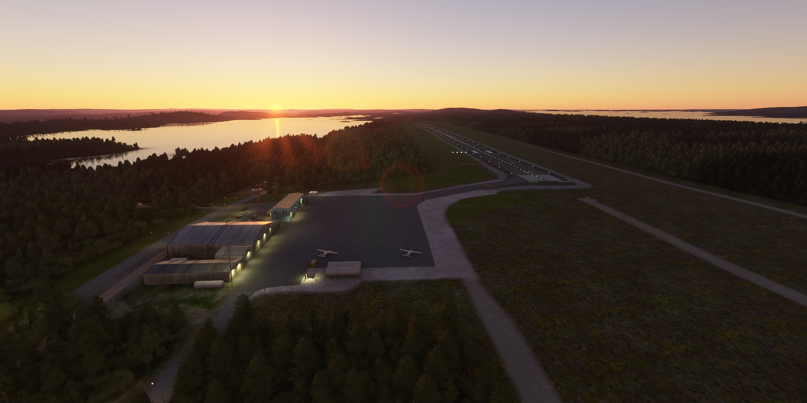
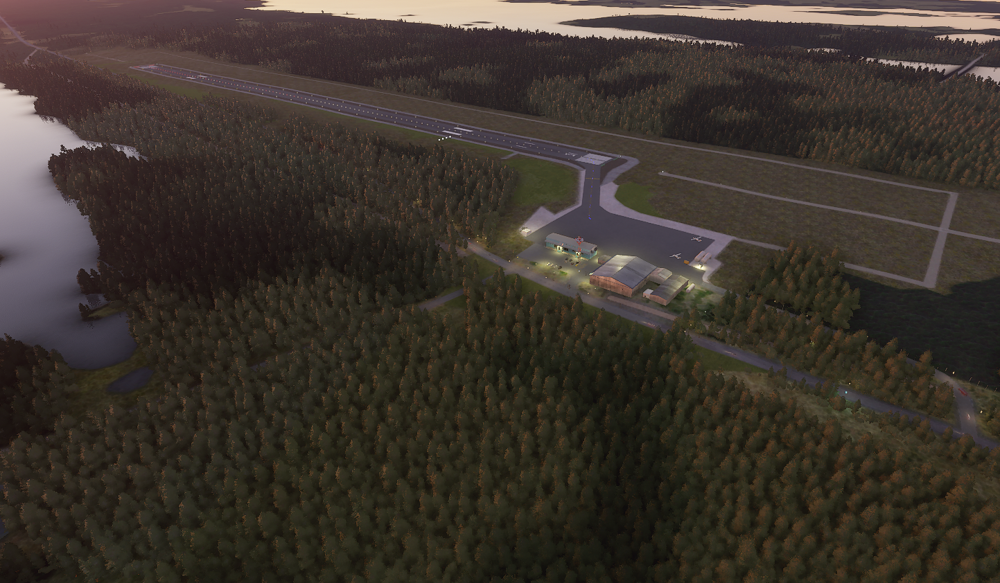
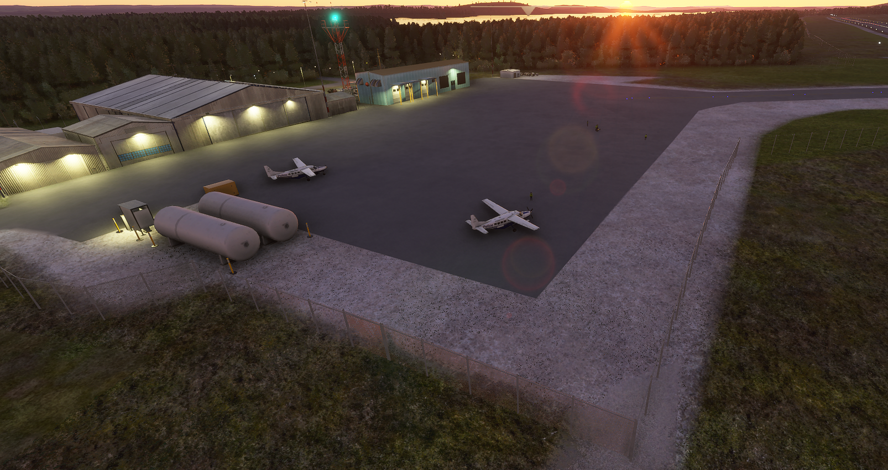
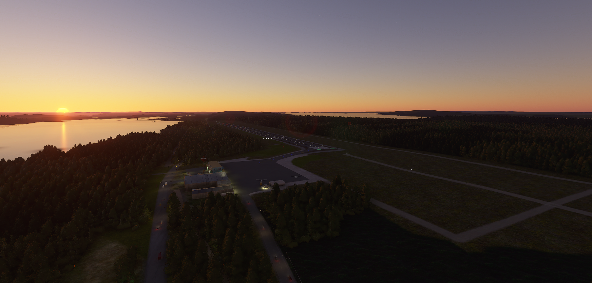
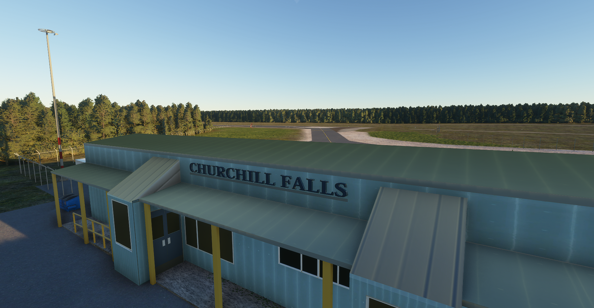
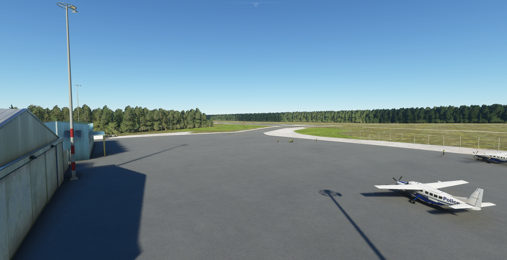
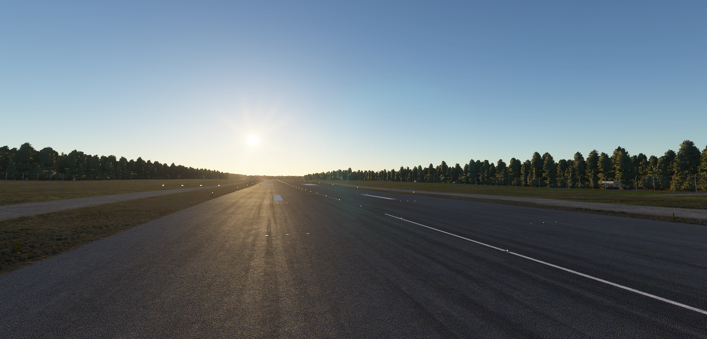
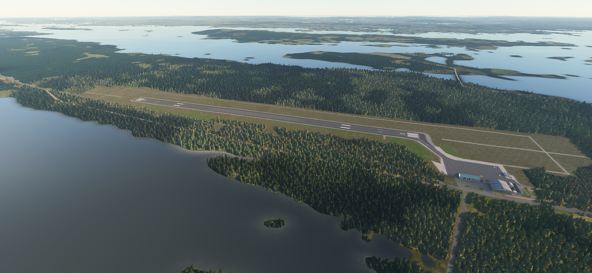
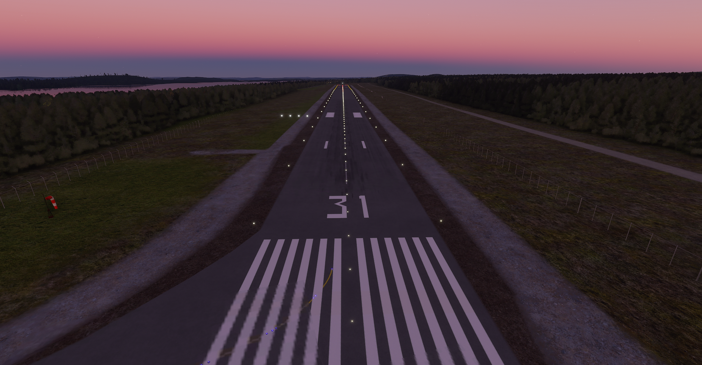
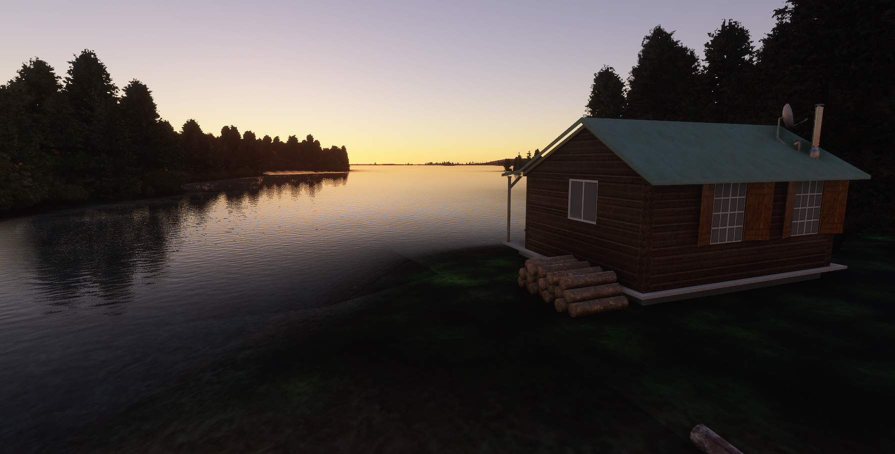

# CZUM - Churchill Falls Airport
#### Author: Julysfire
Discord: julysfire#9465        MSFS2020: blackflame0729

##### Description
CZUM - Churchill Falls Airport, Churchill Falls, Newfoundland and Labrador, Canada

Cords: 53°33'40.0"N 64°05'51.5"W

##### Summary

Churchill Falls Airport is located near Churchill Falls in the beautiful Newfoundland and Labradaor in Canada.  A small airport with no formal terminal is home to a few hangars and a beautiful area landscape filled with lush forests, flowing rivers, valleys, hills, and the Churchill Falls waterfall.  I encourage you to fly some VFR around this area and enjoy the beauty that nature has offered here.

SkyVector: <https://skyvector.com/airport/CZUM/Churchill-Falls-Airport>

Wikipedia: <https://en.wikipedia.org/wiki/Churchill_Falls_Airport>

Google Maps: <https://goo.gl/maps/2PuGdBuHHEBfbZ7o9>

##### Features

- **Entire airport that is not currently in the base game**

- Hand crafted airport and scenery
- Handful of GA parking spots
- Did some work on some of the surrounding roads
- Fixed the airport buildings that didn't auto generate including custom models
- Better ground textures and vegetation of the surrounding area
- Lots of increased vegetation to make it give it the feeling of the surrounding forest (It is just fields in base game)
- Fixed a good amount of water height levels
- Realistic look and feel based on satellite imagery
- Realistic night lighting around the hangars/runway/aprons

#### ---Installation Instructions---
1. Download the .zip file from Releases (or zip file here)
2. Extract files to the your Microsoft Flight Simulator Community Folder

For the Microsoft Store edition AND/OR Gamepass edition:

	C:\Users\[YOUR USERNAME]\AppData\Local\Packages\Microsoft.FlightSimulator_<RANDOMLETTERS>\LocalCache\Packages\Community
	
For the Steam edition:

	C:\Users\[YOUR USERNAME]\AppData\Roaming\Microsoft Flight Simulator\Packages\Community

## Screenshots

More in the Screenshots folder!

## TODO

1. Look into 3D modeling the actual Falls, I think it would look much nicer
2. 3D model the other hangar
3. Better textures
4. Continued improvement on the surrounding vegetation

If you enjoyed it as well and would like to donate, it is very much appreciated but never will be required.  I am doing this to add to the community and because I found I enjoyed it.
http://paypal.me/julysfire